# Power Ops architecture map

Updated 2026-09-23.

## What Power Ops actually is

Power Ops / J Utility Palette is **one standalone Windows WPF application**.

It currently exposes **10 primary navigation modules**:

1. Dashboard
2. Repository Hub
3. Portal Launcher
4. Tool Launcher
5. System / Cheat Sheet
6. Resource Hub
7. Capture
8. Clipboard Library
9. Prompt Builder
10. Settings

The eight modules from Repository Hub through Prompt Builder are the main functional work surfaces. Dashboard is the summary/navigation surface, and Settings owns app configuration and workspace import/export.

Clipboard Library contains two internal surfaces: **Text** and **Images & clips**. Capture contains six capture kinds: **Inbox, To-do, Quick note, Bookmark, Read later, Transcript**.

The same data is presented through three layouts: **Expanded, Compact, Sidebar**. Window behavior is independent of layout and can be **Normal, Always on top, or Summon / hide**.

## Complete map

```mermaid
flowchart TB
    APP["Power Ops / J Utility Palette<br/>ONE standalone Windows WPF app"]

    APP --> SHELL["Shared Power Ops shell"]
    SHELL --> LAYOUTS["3 layouts<br/>Expanded · Compact · Sidebar"]
    SHELL --> BEHAVIOR["Window behavior<br/>Normal · Always on top · Summon/Hide"]
    SHELL --> RIBBON["Global quick ribbon + Ctrl+K search"]

    APP --> MODULES

    subgraph MODULES["10 primary modules"]
      direction TB

      DASH["1. Dashboard<br/>Counts · quick access · capture board"]

      subgraph DEV["Development & launch"]
        REPO["2. Repository Hub<br/>GitHub · Website · Server · ChatGPT links<br/>Saved repo lists · GitHub sync"]
        PORTAL["3. Portal Launcher<br/>Service home pages + project sub-links"]
        TOOLS["4. Tool Launcher<br/>Launch VS Code and local utilities"]
        SYSTEM["5. System / Cheat Sheet<br/>CPU/architecture · config paths · hosts · dev references"]
      end

      subgraph KNOWLEDGE["Resources & capture"]
        RESOURCE["6. Resource Hub<br/>GitHub · Drive · Dropbox · OneDrive · SharePoint · Notion"]
        CAPTURE["7. Capture<br/>Inbox · To-do · Quick note · Bookmark · Read later · Transcript"]
      end

      subgraph CLIP["Clipboard & prompts"]
        CLIPBOARD["8. Clipboard Library"]
        CLIPTEXT["Text<br/>Snippets · commands · URLs · reusable text"]
        CLIPMEDIA["Images & clips<br/>Screenshots · PNG/JPG/WebP/GIF · MP4/WebM/MOV"]
        PROMPT["9. Prompt Builder<br/>Ordered modules · variables · project context · recent prompts"]
        CLIPBOARD --> CLIPTEXT
        CLIPBOARD --> CLIPMEDIA
      end

      SETTINGS["10. Settings<br/>Window · GitHub owner · starter catalog · import/export"]
    end

    subgraph DATA["Shared local-first data layer — schema v6"]
      JSON["workspace.json"]
      BACKUP["workspace.backup.json"]
      MEDIA["media/<br/>managed image/video files"]
      MODELS["Projects · Lists · Portals · Tools · Resources<br/>Snippets · Media metadata · Prompt modules · Captures"]
      JSON --> MODELS
      JSON --> BACKUP
      CLIPMEDIA --> MEDIA
    end

    REPO --> GITHUB["GitHub / local gh CLI"]
    PORTAL --> WEB["Default browser / web portals"]
    RESOURCE --> WEB
    TOOLS --> LOCAL["Windows local processes / apps"]
    SYSTEM --> WINDOWS["Windows OS + filesystem"]
    CLIPTEXT --> WINCLIP["Windows clipboard"]
    CLIPMEDIA --> WINCLIP

    CAPTURE --> JSON
    PROMPT --> JSON
    REPO --> JSON
    PORTAL --> JSON
    TOOLS --> JSON
    RESOURCE --> JSON
    CLIPBOARD --> JSON
    SETTINGS --> JSON

    DASH -. summary of .-> REPO
    DASH -. summary of .-> PORTAL
    DASH -. summary of .-> RESOURCE
    DASH -. summary of .-> CAPTURE
    DASH -. summary of .-> CLIPBOARD
```

## Architectural rule

Do not split these modules into separate applications unless there is a strong technical reason. They intentionally share:

- one WPF shell;
- one local workspace;
- one quick ribbon/search/navigation model;
- one schema/versioning system;
- one import/export path;
- one Windows summon/placement system.

External tools launched by **Tool Launcher** are not Power Ops modules; they are external applications Power Ops opens.
