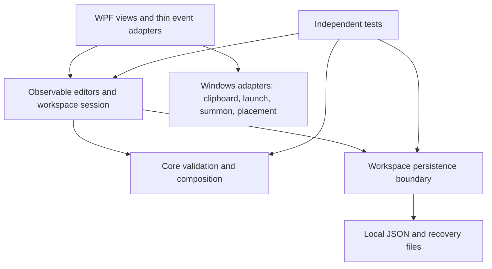

# Product vision and architecture

Decision date: 2026-09-08. The user confirmed reliability and polish before broad expansion.

## Product outcome

J Utility Palette should shorten the recurring act of gathering project links, composing instructions, and capturing temporary notes while another application is in use. It should be fast to reveal, predictable to copy from, and safe to trust with locally stored text.

| Capability | Why it matters | Finished behavior |
| --- | --- | --- |
| Safe local workspace | Prompts and notes must survive failures and upgrades | Explicit validation, recoverable writes, understandable recovery, safe import/export |
| Project clipboard | Repeatedly gathering repository/site links wastes time | Accurate field selection, clear Open/Copy actions, validated edits, archive views |
| Prompt composer | Reusing good instructions reduces repetitive editing | Stable ordering, variable inputs, transparent unresolved placeholders, reusable history |
| Notes | Capture small pieces of context without changing applications | Reliable edits, pin/archive filters, useful project association |
| Window access | A companion should remain available without dominating the desktop | Predictable summon, normal/topmost modes, recoverable visibility, sensible monitor placement |
| Distribution and polish | A personal tool should be easy to run and maintain | Usable small layouts, keyboard access, release package, documented data behavior |

Out of scope until a deliberate lead/product decision: PowerToys fork integration, cloud sync, mandatory accounts, embedded browser automation, hardware monitoring, power plans, feeds, and a general plugin platform. Optional GitHub status is a later experiment; local features remain functional without it.

## Existing implementation

- `JUtility.Core`: mutable workspace DTOs, JSON store, URL normalization, clipboard formatting, prompt composition.
- `JUtility.App`: WPF view and view model, native clipboard/process calls, global mouse hook, monitor positioning.
- `JUtility.SmokeTests`: package-free executable referencing Core, currently seven checks.

The existing split is appropriate. The current implementation is a prototype foundation with a build blocker and incomplete failure paths; existing README/roadmap statements describe implemented scope rather than proven release readiness.

## Target boundaries

Core remains independent of WPF and Win32. Views bind to observable editor state; they do not decide recovery, migration, or persistence policies. A workspace session coordinates loading, dirty state, save snapshots, and import replacement. Windows adapters contain clipboard/process/native behavior and expose small seams where failure testing needs them. Keep code-behind for straightforward view event translation; a framework-wide rewrite is not required.

Retain local JSON and the current projects. Extract types only where they clarify a responsibility or enable meaningful testing. Avoid a generic repository framework, service container, event bus, database, or new UI stack in this phase.

## Engineering decisions and invariants

**A01 — Validated data boundary.** Read/deserialize, classify schema, migrate supported legacy formats, validate, then expose a complete state. Unknown future schemas must never be silently rewritten as current. Missing schema is legacy only when recognizable workspace structure exists. `{}` is not an importable workspace. Empty workspaces with a supported explicit version remain valid.

**A02 — Preserve recovery evidence.** Only an actually new directory may be seeded automatically. Invalid, inaccessible, and unsupported files are distinct outcomes. Never replace the last known good backup with a corrupt primary while recovering. Preserve original bytes before explicit recovery/reset; do not silently seed over evidence.

**A03 — Transactional writes.** Validate and serialize a detached snapshot, write a unique temporary file in the destination directory, and publish by an appropriate replacement operation. No success until publication completes. A failed operation keeps a usable prior state or recoverable valid backup. Recovery and normal save have distinct backup policies. Do not claim immunity to every power failure; define and test process/I/O failure behavior.

**A04 — One writer.** A user/session may have only one app writer for a canonical data directory. Acquire ownership before loading or creating workspace files. A second launch gives an understandable result and cannot overwrite the active instance. Cross-process activation is deferred; preservation is mandatory.

**A05 — Honest editing state.** Every persisted edit makes the session dirty. Saved means the corresponding snapshot was committed. An older completed save cannot clear newer edits. Failed save keeps edits available and produces an actionable error. Import replaces the in-memory session only after validation and durable commit; clear/rebind all selection references.

**A06 — Observable presentation.** DTOs are serialization records, not the WPF change-notification contract. Prefer thin observable editor wrappers with explicit snapshot mapping. Keep identity stable within a session; detach subscriptions when replacing/removing items. No duplicate authoritative state that diverges silently.

**A07 — Platform isolation.** Disk access never runs in the low-level mouse callback. The callback remains small; visibility decisions are dispatched to WPF. Clipboard and launch failures are contained and do not imply success. Temporary Keep open is session state, not a persisted window mode.

**A08 — Explicit semantics.** Open opens a validated HTTP/HTTPS target; Copy copies the chosen text. Hiding Extra never removes its value. Archive is reversible; deletion and whole-workspace replacement must be deliberate. Unknown prompt placeholders remain visible, with warnings when variable UX is implemented.

**A09 — Evidence before expansion.** Full solution build, core/session checks, and appropriate Windows interaction evidence are separate gates. Native input and mixed-DPI behavior cannot be inferred from pure unit tests.

## Sequence

S01 makes build, storage, and edits trustworthy. S02 hardens window access and small-screen usability. S03 completes project/note organization. S04 completes prompt workflows. S05 prepares a distributable release. These are sequencing envelopes; only S01 is currently authorized for development, and later boundaries may change after review.
